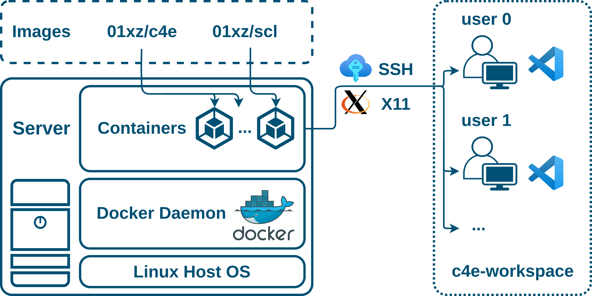

# c4e

Containers for commercial EDA tools.



Similar to [Synopsys Container](https://www.synopsys.com/support/licensing-installation-computeplatforms/compute-platforms/containers.html), c4e is also a container environment that provides OS libraries and other dependencies for commercial EDA tools (e.g., Virtuoso, Calibre, Design Compiler).

Note that c4e itself does not contain any commercial EDA tools.

```shell
$ docker build -t c4e:latest -f Dockerfile .
```

- enter the `c4e-workspace` directory;
- edit `devcontainer.json` and `setup.sh` regarding your situation;
- click `reopen in container` in VS Code.
